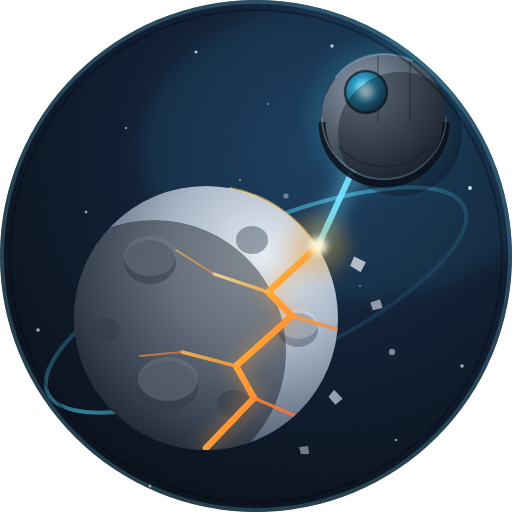

<p align="center">
  
</p>

# og-bot-discord

A Discord bot for the [OGame](https://www.ogame.gameforge.com/) community. It
reads Gameforge's public OGame API and helps players with day-to-day tasks:
looking up players and their planets, computing trade rates, estimating
expedition cargo, generating moon-lock galaxy links, listing alliance members
and computing moonbreak (lune) destruction probabilities.

The bot has been running for a long time on the French OGame Discord. This
version is modernized (Node 24 + ESM, discord.js v14) so any community/country
can run its own instance.

## Commands

All commands are triggered by a prefix in any channel the bot can read.
`<n°>` is the server number and `<lang>` the community code (`fr`, `en`, `de`,
`es`, …), matching the API host `s<n°>-<lang>.ogame.gameforge.com`.

| Command | Description | Example |
| --- | --- | --- |
| `!ogp <n°> <lang> <player name>` | Show a player's planets (with moons) and points. | `!ogp 176 fr Darth Vader` |
| `!ogc <M\|C\|D> <p1/p2> <rate> <amount>` | Trade calculator. Resource to sell (Metal/Crystal/Deut), split percentages of the two other resources, exchange `rate` as `metal:crystal:deut`, and the amount. | `!ogc M 60/40 2:1.5:1 20000000` |
| `!ogs <n°> <lang>` | Show a server's settings (speeds, debris factor, galaxies…). | `!ogs 176 fr` |
| `!oge <n°> <lang> <hyperspace level>` | Expedition cargo estimate for a pathfinder given the top-1 score and hyperspace tech level. | `!oge 176 fr 20` |
| `!ogl <n°> [lang] <galaxy:system:position>` | Galaxy link to a position + number of keys/probes needed to reach the 2M-debris moon-lock threshold. `lang` defaults to `fr`. | `!ogl 176 fr 3:145:8` |
| `!oga <n°> <lang> <alliance name or tag>` | List the members of an alliance. | `!oga 176 fr TWA` |
| `!mb <moon size> <RIPs> [<RIPs> …]` | Moonbreak probability + RIP-loss estimate. Moon size in km (3464–8944), 1 to 4 attackers. | `!mb 8944 100 80` |
| `!og help` | Show the in-Discord command list. | `!og help` |

## Requirements

- **Node.js >= 24** (the `ogamejs` dependency requires it).
- A Discord application + bot token.
- Optionally Docker for deployment.

## Discord setup

1. Create an application at the
   [Discord Developer Portal](https://discord.com/developers/applications).
2. Add a **Bot** and copy its token.
3. Under **Bot → Privileged Gateway Intents**, enable **Message Content Intent**.
   The bot reads message text to detect commands and will not work without it.
4. Invite the bot to your server with the `bot` scope and the
   *Send Messages* / *Read Message History* permissions.

## Configuration

The bot reads the `DISCORD_TOKEN` environment variable.

Copy the example env file and fill it in (git-ignored):

```bash
cp scripts/.env.example scripts/.env
# edit scripts/.env and set DISCORD_TOKEN=...
```

## Run locally

```bash
npm install
./scripts/start.sh      # loads scripts/.env then runs `node index.js`
```

Or without the helper script:

```bash
DISCORD_TOKEN=your-token npm start
```

## Run with Docker

The token is injected at runtime (never baked into the image):

```bash
docker build -t og-bot:latest .
docker run --name og-bot -d --restart unless-stopped \
  -e DISCORD_TOKEN=your-token og-bot:latest
```

## Deploy

`scripts/deploy.sh` SSHes into a host, pulls `master`, rebuilds the image and
restarts the container. It needs `USER`, `IP_ADDR` and `DISCORD_TOKEN` in
`scripts/.env`.

```bash
npm run deploy
```

## Development

```bash
npm run lint    # ESLint (flat config, eslint.config.js)
npm test        # node:test smoke tests for the pure functions
```

## Project structure

| File | Responsibility |
| --- | --- |
| `index.js` | Discord client, intents, command routing. |
| `players.js` / `players.utils.js` | `!ogp` and shared player/alliance API helpers. |
| `commerce.js` | `!ogc` trade calculator (uses `ogamejs`). |
| `serverData.js` | `!ogs` server settings. |
| `expeditions.js` | `!oge` expedition cargo estimate. |
| `create-link.js` | `!ogl` galaxy link + moon-lock key/probe counts. |
| `alliances.js` / `alliances.utils.js` | `!oga` alliance member listing. |
| `mb.js` | `!mb` moonbreak probability + loss model. |
| `utils.js` | `prettify` number formatting and `parseServerData`. |
| `assets/logo.svg` | Logo source (vector). `logo-512.png` is the Discord avatar, `logo-128.png` the small size. |

## OGame API

The bot consumes Gameforge's public XML API (verified working in 2026):

- `https://s<n°>-<lang>.ogame.gameforge.com/api/serverData.xml`
- `.../api/players.xml`, `.../api/universe.xml`, `.../api/playerData.xml?id=<id>`
- `.../api/alliances.xml`

These endpoints refresh roughly once a day, so player/planet data reflects the
last daily snapshot rather than live positions.
