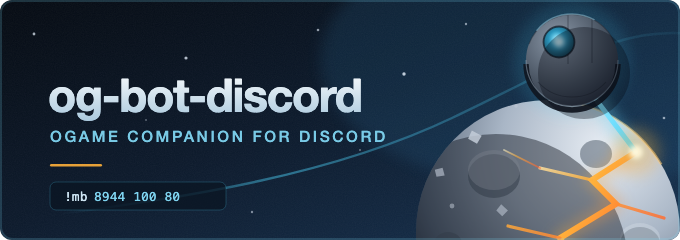

<p align="center">
  
</p>

# og-bot-discord

A Discord bot for the [OGame](https://www.ogame.gameforge.com/) community. It
reads Gameforge's public OGame API and helps players with day-to-day tasks:
looking up players and their planets, computing trade rates, estimating
expedition cargo, generating moon-lock galaxy links, listing alliance members
and computing moonbreak (lune) destruction probabilities.

The bot has been running for a long time on the French OGame Discord. This
version is modernized (Node 24 + ESM, discord.js v14) so any community/country
can run its own instance.

## Commands

All commands are triggered by a prefix in any channel the bot can read.
`<n°>` is the server number and `<lang>` the community code (`fr`, `en`, `de`,
`es`, …), matching the API host `s<n°>-<lang>.ogame.gameforge.com`.

| Command | Description | Example |
| --- | --- | --- |
| `!ogp <n°> <lang> <player name>` | Show a player's planets (with moons) and points. | `!ogp 176 fr Darth Vader` |
| `!ogc <M\|C\|D> <p1/p2> <rate> <amount>` | Trade calculator. Resource to sell (Metal/Crystal/Deut), split percentages of the two other resources, exchange `rate` as `metal:crystal:deut`, and the amount. | `!ogc M 60/40 2:1.5:1 20000000` |
| `!ogs <n°> <lang>` | Show a server's settings (speeds, debris factor, galaxies…). | `!ogs 176 fr` |
| `!oge <n°> <lang> <hyperspace level>` | Expedition cargo estimate for a pathfinder given the top-1 score and hyperspace tech level. | `!oge 176 fr 20` |
| `!ogl <n°> [lang] <galaxy:system:position>` | Galaxy link to a position + number of keys/probes needed to reach the 2M-debris moon-lock threshold. `lang` defaults to `fr`. | `!ogl 176 fr 3:145:8` |
| `!oga <n°> <lang> <alliance name or tag>` | List the members of an alliance. | `!oga 176 fr TWA` |
| `!mb <moon size> <RIPs> [<RIPs> …]` | Moonbreak probability + RIP-loss estimate. Moon size in km (3464–8944), 1 to 4 attackers. | `!mb 8944 100 80` |
| `!og help` | Show the in-Discord command list. | `!og help` |

## Requirements

- **Node.js >= 24** (the `ogamejs` dependency requires it).
- A Discord application + bot token.
- Optionally Docker for deployment.

## Discord setup

1. Create an application at the
   [Discord Developer Portal](https://discord.com/developers/applications).
2. Add a **Bot** and copy its token.
3. Under **Bot → Privileged Gateway Intents**, enable **Message Content Intent**.
   The bot reads message text to detect commands and will not work without it.
   Without it, `client.login()` fails outright with `Used disallowed intents`.
4. Invite the bot to your server (see below).

## Invite the bot

Replace `YOUR_APPLICATION_ID` with the Application ID from the Developer Portal:

```
https://discord.com/oauth2/authorize?client_id=YOUR_APPLICATION_ID&permissions=84992&scope=bot
```

`permissions=84992` is the minimum this bot actually needs:

| Permission | Value | Why |
| --- | --- | --- |
| View Channels | 1024 | read the channels commands are typed in |
| Send Messages | 2048 | plain-text replies |
| Embed Links | 16384 | `!og help`, `!ogp`, `!oga` reply with embeds |
| Read Message History | 65536 | channel read context |

**Embed Links is the one that is easy to miss.** Without it the bot connects,
sees commands, and silently fails on every command that replies with an embed —
which is most of them. The `catch` in `index.js` then tries to send the help
message, which is *also* an embed, so nothing appears at all.

No `applications.commands` scope: this bot uses prefix commands (`!ogp`, `!mb`),
not slash commands.

If the bot joins but stays silent, check channel-level permission overrides
first — they take precedence over the role permissions granted by this link.

## Configuration

The bot reads two environment variables:

| Variable | Default | Purpose |
| --- | --- | --- |
| `DISCORD_TOKEN` | — | Bot token. Required; the process exits immediately without it. |
| `PORT` | `8080` | Port of the health endpoint. |

## Run locally

```bash
npm install
DISCORD_TOKEN=your-token npm start
```

Prefer a `.env` file? It is git-ignored, and Node reads it natively — no
dependency needed:

```bash
echo 'DISCORD_TOKEN=your-token' > .env
node --env-file=.env index.js
```

## Run with Docker

The token is injected at runtime (never baked into the image):

```bash
docker build -t og-bot:latest .
docker run --name og-bot -d --restart unless-stopped \
  -e DISCORD_TOKEN=your-token og-bot:latest
```

## Health endpoint

The bot exposes a single HTTP route on `PORT` (default `8080`), used by
container platforms to tell a live bot from a stuck one:

```
GET /health  ->  200 {"status":"ok","user":"…","guilds":3,"uptime":42}
             ->  503 {"status":"connecting", …}  while the gateway is down
```

## Deploy

Deployment is fully automated. Pushing to `master` runs
[`.github/workflows/deploy.yml`](.github/workflows/deploy.yml), which lints and
tests, builds and pushes the image to GHCR, then asks Scaleway Serverless
Containers to redeploy it and waits until the container reports `ready`.

The bot runs as a single always-on instance (`min_scale = max_scale = 1`): it
holds a persistent gateway connection, so it must never be scaled to zero, and
never run twice — two instances would answer every command twice.

Infrastructure lives in a separate repository and is managed with Terraform.
This repository never runs Terraform; it only needs three secrets:

| Secret | Purpose |
| --- | --- |
| `SCW_SECRET_KEY` | Scoped IAM key, containers only, single project |
| `SCW_CONTAINER_ID` | Container to redeploy |
| `SCW_REGION` | Scaleway region, e.g. `fr-par` |

`DISCORD_TOKEN` is **not** among them. It is stored as an encrypted environment
variable on the container itself and injected at startup, so it never reaches
the CI and is never present in an image layer.

## Development

```bash
npm run lint    # ESLint (flat config, eslint.config.js)
npm test        # node:test smoke tests for the pure functions
```

## Project structure

| File | Responsibility |
| --- | --- |
| `index.js` | Discord client, intents, command routing. |
| `players.js` / `players.utils.js` | `!ogp` and shared player/alliance API helpers. |
| `commerce.js` | `!ogc` trade calculator (uses `ogamejs`). |
| `serverData.js` | `!ogs` server settings. |
| `expeditions.js` | `!oge` expedition cargo estimate. |
| `create-link.js` | `!ogl` galaxy link + moon-lock key/probe counts. |
| `alliances.js` / `alliances.utils.js` | `!oga` alliance member listing. |
| `mb.js` | `!mb` moonbreak probability + loss model. |
| `utils.js` | `prettify` number formatting and `parseServerData`. |
| `assets/logo.svg` | Logo source (vector). `logo-512.png` is the Discord avatar, `logo-128.png` the small size. |
| `assets/banner.svg` | Banner source (vector). `banner-680x240.png` is the Discord app banner. |

## OGame API

The bot consumes Gameforge's public XML API (verified working in 2026):

- `https://s<n°>-<lang>.ogame.gameforge.com/api/serverData.xml`
- `.../api/players.xml`, `.../api/universe.xml`, `.../api/playerData.xml?id=<id>`
- `.../api/alliances.xml`

These endpoints refresh roughly once a day, so player/planet data reflects the
last daily snapshot rather than live positions.
